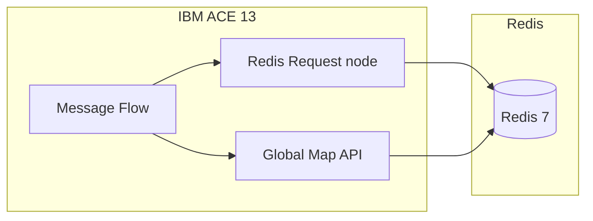

# PoC: Redis con IBM ACE 13

Proof of Concept para integrar **Redis** como capa de cache y datos de alta velocidad con **IBM App Connect Enterprise 13**.

## ¿Qué incluye esta PoC?

| Componente | Descripción |
|------------|-------------|
| **Infra Redis** | Docker Compose con Redis 7.2 para pruebas locales |
| **Scripts** | Verificación, datos de ejemplo y latencia |
| **Config ACE 13** | Redis Connection policy, credenciales, Java de ejemplo |
| **Flujos (diseño)** | Escenarios HTTP + Redis Request / Global Map con Redis |
| **Documentación** | Arquitectura, beneficios para integración, guía paso a paso |

## Requisitos

- **IBM ACE Toolkit / Runtime 13.0.3+** (Redis Global Cache)
- **ACE 13.0.5+** para el nodo **Redis Request** dedicado
- Docker (Redis local) o instancia Redis accesible (v6–v7)
- `redis-cli` opcional (los scripts usan Docker si no está instalado)

## Inicio rápido

```bash
# 1. Levantar Redis
cd poc-redis-ace13/infra
cp .env.example .env
docker compose up -d

# 2. Verificar y cargar datos de prueba
cd ..
./scripts/verify-redis.sh
./scripts/seed-redis.sh

# 3. (En servidor ACE) Configurar credencial
./scripts/setup-ace-credential.sh redis::pocRedisCredential localhost 6379

# 4. Implementar flujos en Toolkit según flows/DISENO_FLUJOS.md
```

Guía detallada: [QUICK_START.md](QUICK_START.md)

## Documentación

| Documento | Contenido |
|-----------|-----------|
| [QUICK_START.md](QUICK_START.md) | Pasos completos de la PoC |
| [docs/ARQUITECTURA.md](docs/ARQUITECTURA.md) | Arquitectura Redis + ACE 13 |
| [docs/BENEFICIOS_INTEGRACION.md](docs/BENEFICIOS_INTEGRACION.md) | Valor para equipos de integración |
| [docs/ESCENARIOS_POC.md](docs/ESCENARIOS_POC.md) | Casos de prueba y criterios de éxito |
| [flows/DISENO_FLUJOS.md](flows/DISENO_FLUJOS.md) | Diseño de message flows en Toolkit |

## Dos formas de integrar Redis en ACE 13



1. **External Redis Global Cache** (13.0.3+): API de mapas (Mapping/JavaCompute) con backend Redis — ideal para migrar desde WXS.
2. **Redis Request node** (13.0.5+): operaciones directas en Redis (strings, hashes, lists, sets) con mínimo código.

## Estructura del repositorio

```
poc-redis-ace13/
├── README.md
├── QUICK_START.md
├── docs/
├── flows/
├── infra/          # docker-compose, redis.conf
├── scripts/        # verify, seed, latency, credential
└── ace/
    ├── policies/   # Redis Connection policy
    └── java/       # JavaCompute para Global Map + Redis
```

## Referencias IBM

- [ACE 13.0.3 — Redis Global Cache](https://community.ibm.com/community/user/blogs/ben-thompson1/2025/03/30/ace-13-0-3-0)
- [Nuevas capacidades ACE 13 vs 12](https://community.ibm.com/community/user/blogs/matthias-blomme/2026/04/27/new-features-v13-vs-v12)

---

**Última actualización:** Marzo 2026
