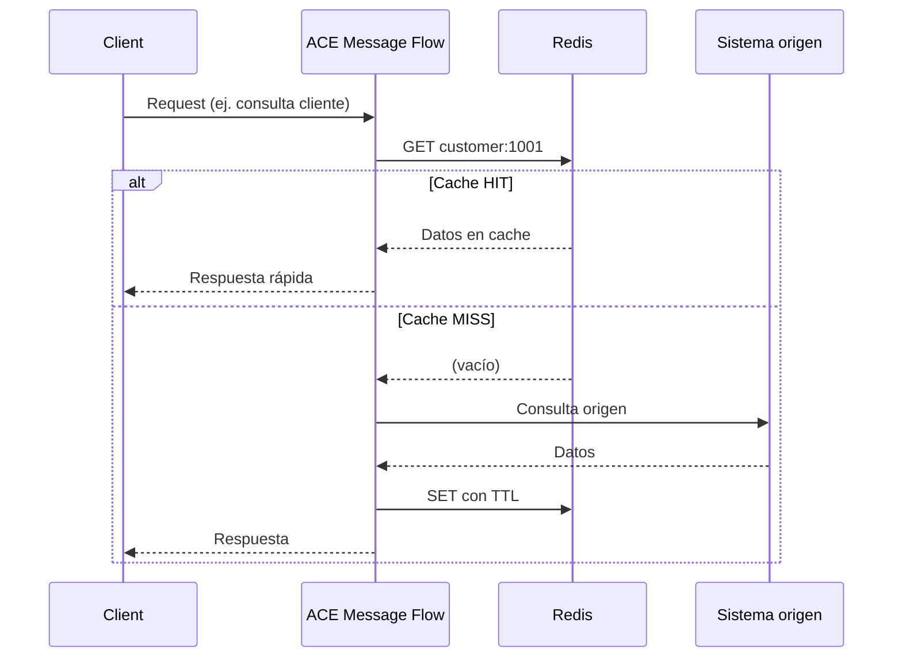

# Arquitectura — Redis e IBM ACE 13

## Contexto: Redis como capa de cache en ACE 13

En ACE 13, **Redis** es la opción recomendada para cache **compartido, persistente y enterprise-wide** en integraciones. IBM deprecó **WebSphere eXtreme Scale (WXS)** como backend de Global Cache; la migración natural en ACE 13 apunta a **Redis externo**.

Esta PoC se centra en **dos formas de integrar Redis** con message flows:

| Capacidad | Desde | Descripción |
|-----------|-------|-------------|
| **External Redis Global Cache** | 13.0.3 | API de mapas globales (Mapping / JavaCompute) con backend Redis |
| **Redis Request node** | 13.0.5 | Nodo dedicado para operaciones Redis (strings, hashes, lists, sets, sorted sets) |

Referencias: [ACE 13.0.3 — Redis Global Cache](https://community.ibm.com/community/user/blogs/ben-thompson1/2025/03/30/ace-13-0-3-0), [ACE 13 vs 12](https://community.ibm.com/community/user/blogs/matthias-blomme/2026/04/27/new-features-v13-vs-v12).

---

## Modelos de arquitectura con Redis

### Modelo A — External Redis Global Cache

```
┌──────────────────┐         ┌──────────────────┐
│  ACE Server 1    │         │  ACE Server 2    │
│  Message Flow    │         │  Message Flow    │
│  Global Map API  │         │  Global Map API  │
└────────┬─────────┘         └────────┬─────────┘
         │    Redis Connection         │
         │         Policy              │
         └────────────┬────────────────┘
                      ▼
              ┌───────────────┐
              │  Redis Cluster │
              │  (externo)     │
              └───────────────┘
                      ▲
              ┌───────┴───────┐
              │ Otras apps    │
              │ (microservicios)│
              └───────────────┘
```

**Cuándo usarlo:**
- Varios sistemas deben compartir el mismo cache (ACE + APIs + batch)
- Reemplazo de grid WXS externo en migraciones ACE 12 → 13
- Necesitas persistencia, réplicas o clustering gestionado por Redis
- Separar ciclo de vida del cache del runtime ACE
- Equipos que ya usan **Global Map** en mappings y quieren migrar el backend a Redis con cambios mínimos

**Integración ACE:**
1. **Redis Connection policy** en Policy Project
2. Credencial tipo Redis (`mqsisetdbparms`)
3. **Mapping node** o **JavaCompute** con `MbGlobalMap.getGlobalMap(mapName, policyProject, policyName)`

---

### Modelo B — Redis Request node (acceso directo)

```
[HTTP/MQ Input] → [Redis Request] → [Transform] → [Reply]
                        │
                        ▼
                   Redis (strings, hashes, lists...)
```

**Cuándo usarlo:**
- Operaciones Redis explícitas (TTL, hashes de catálogo, sorted sets para prioridad)
- Menos código que JavaCompute + librerías Jedis/Lettuce
- Flujos de integración que actúan como API sobre Redis
- Máximo control sobre tipos de datos Redis sin programar Java

**Requisito:** ACE **13.0.5+**. Documentación de producto orienta a IBM Cloud Databases for Redis; en PoC on-prem validar con tu fix pack.

---

## Flujo de datos típico en integración (cache-aside)



Este patrón reduce carga al backend y mejora tiempos de respuesta en integraciones de alto volumen.

---

## Componentes de la PoC

| Capa | Artefacto en repo |
|------|-------------------|
| Redis | `infra/docker-compose.yml`, `infra/redis.conf` |
| Credenciales ACE | `scripts/setup-ace-credential.sh` |
| Policy | `ace/policies/example-redis-connection.policy.xml` |
| Lógica de negocio | `ace/java/RedisGlobalCachePoC.java`, `flows/DISENO_FLUJOS.md` |

---

## Decisiones de diseño

### ¿Global Map + Redis o Redis Request node?

| Criterio | Global Map + Redis policy | Redis Request node |
|----------|---------------------------|---------------------|
| Migración desde WXS / Global Map existente | Ideal (misma API) | Requiere rediseño del flujo |
| Control fino Redis (hash, ZSET, TTL por operación) | Limitado | Alto |
| Complejidad en flujo | Baja | Media (discovery connector) |
| Versión ACE mínima | 13.0.3 | 13.0.5 |
| Código custom | Opcional (JavaCompute) | Mínimo (nodo nativo) |

**Recomendación PoC:** empezar con **Redis Request** si tienes 13.0.5+ (más visible en demo); usar **Global Map + Redis** si migras flujos que ya usan mapas globales.

### ¿Por qué Redis y no solo el backend?

| Sin Redis | Con Redis |
|-----------|-----------|
| Cada request golpea CRM/ERP/mainframe | Cache hit evita llamada al origen |
| Latencia de red + procesamiento backend | Sub-ms en lectura desde Redis |
| Sin capa compartida entre ACE y otras apps | Microservicios y batch leen las mismas keys |
| Escalar cache = escalar ACE | Redis escala de forma independiente |

---

## Seguridad (producción)

- Habilitar **TLS** en Redis y en la policy (`useTLS`)
- No usar `protected-mode no` fuera de lab
- Credenciales solo vía `mqsisetdbparms` o vault corporativo
- Red segmentada: solo integration servers acceden al puerto Redis
- Rotación de passwords y auditoría de acceso

---

## Limitaciones conocidas (ACE 13)

- Soporte IBM para Redis externo: uso correcto de la **API Redis**; clustering/replicación es responsabilidad del cliente
- Redis Request node: documentación enfatiza IBM Cloud Redis v6–v7; validar on-prem en PoC
- WXS deprecado: planificar migración a **Redis** en upgrades a ACE 13
